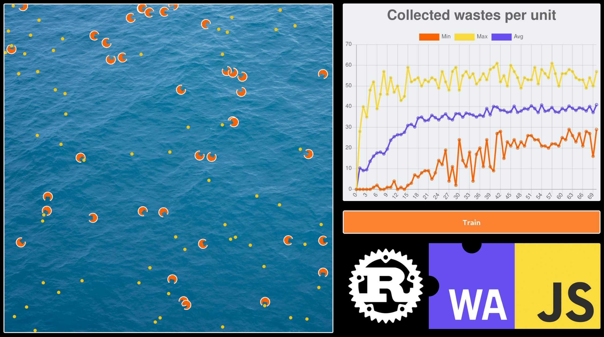

[](https://forthebadge.com)

# Optimizing-Marine-Waste-Collection
Based on Rust 🦀 and WebAssembly 🕸, this project uses a genetic algorithm and neural networks to simulate the optimization of marine waste collection. The goal is to maximize the amount of waste collected while minimizing time and costs.



# Build and Run

```
cd GeneticAlgorithm/libs/simulation-wasm
wasm-pack build
```

```
cd GeneticAlgorithm/www
NODE_OPTIONS=--openssl-legacy-provider npm run start
```

Go to `http://localhost:8080`
